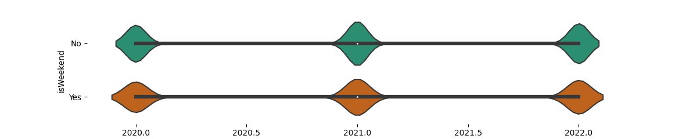
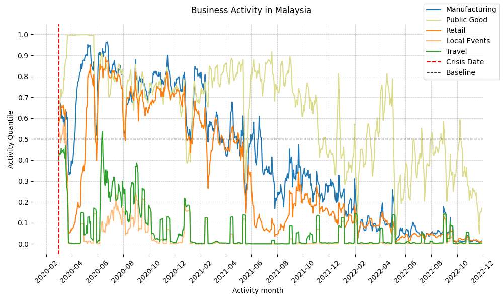
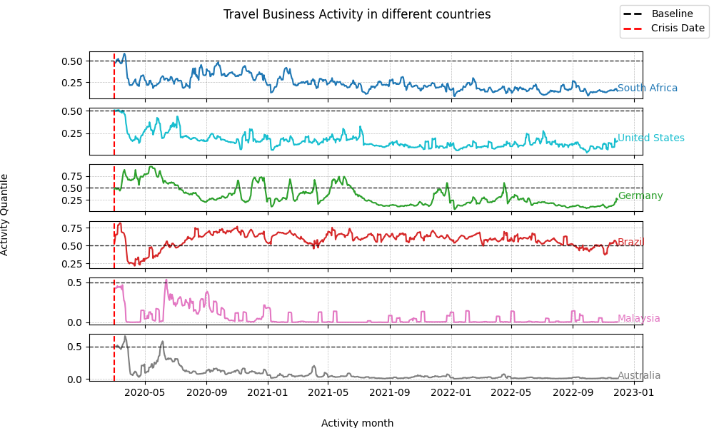
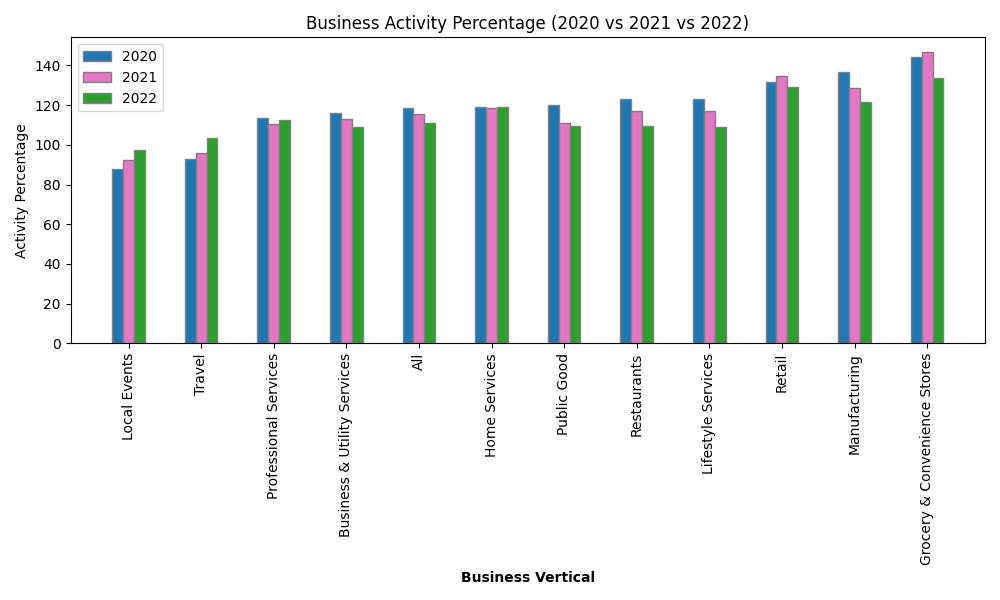

# Facebook Business Activity Trends during COVID-19
Business Activity Trends During COVID-19 uses the rate that businesses post on Facebook compared to pre-crisis levels to measure how crisis events are affecting different economic sectors each day.
## Overview

In this project, we present the "Business Activity Trends," a dataset reflecting the impact of crisis events on businesses through their Facebook posting activity. Initially focused on the COVID-19 pandemic, this global dataset is continually updated to reflect ongoing crises. By comparing the rate of posts on Facebook business pages to pre-crisis levels, we provide daily insights into how different economic sectors are adapting to crisis events.

## Code and Resources Used 
**Python Version:** 3.7  
**Packages:** pandas, geopandas, matplotlib, glob

### Methodology

**Step 1:** Count public posts from Facebook business page administrators before and after a crisis event. All data is de-identified and aggregated.

**Step 2:** Compare post-crisis activity to a baseline from the year prior to the crisis.

**Step 3:** Aggregate data daily for each US county or global equivalent, categorizing business pages by economic sector. The output is an average change percentage.

[Full Methodology Paper](https://dataforgood.facebook.com/dfg/resources/business-activity-trends-methodology-paper)

### Metadata

### Business Verticals

We classify businesses into various verticals, such as Grocery and Convenience Stores, Retail, Restaurants, Local Events, Professional Services, Business and Utility Services, Home Services, Lifestyle Services, Travel, Manufacturing, and Public Good.

### Codebook

- **GADM ID (gadm_id):** The GADM ID of the polygon.
- **GADM Name (gadm_name):** The GADM name refers to the country name of the polygon.
- **Business vertical (business_vertical):** The business vertical of the aggregation. Business verticals are defined internally within Facebook from categories selected by the Page admins. We use business verticals as a proxy for local economic sectors. Included as a business vertical is the “All” category, which includes but is not limited to all the other business verticals.
- **Activity quantile (activity_quantile)**: The level of activity as a quantile relative to the baseline period. This is equivalent to the 7-day average of what the University of Bristol researchers call the aggregated probability integral transform metric (see this article in Nature Communications). It’s calculated by first computing the approximate quantiles (the midquantiles in the article) of each Page’s daily activity relative to their baseline activity. The quantiles are summed and the sum is then shifted, rescaled and variance-adjusted to follow a standard normal distribution. The adjusted sum is then probability transformed through a standard normal cumulative distribution function to get a value between 0 and 1. We then average this value over the last 7 days to smooth out daily fluctuations. We give this metric a quantile interpretation since it compares the daily activity to the distribution of daily activity within the baseline period, where a value around 0.5 is considered normal activity. This is a one-vote-per-Page metric that gives equal weight to all businesses and is not heavily influenced by businesses that post a lot. We advise preferencing this metric, especially if robustness to outliers and numerical stability are important concerns.
- **Activity percentage (activity_percentage)**: The 7-day rolling sum of total activity (i.e., total posts) as a percent of the average weekly baseline average. The weekly baseline average is calculated as the average of the 7-day sum of total activity every Monday within the baseline period. For each day during the crisis, we divide the 7-day rolling sum of total posts by this weekly baseline average and multiply by 100. A value around 100 is considered to be normal activity. This metric is the most easily interpretable but tends to be heavily influenced by businesses that post a lot, which may give misleading results. This metric is also numerically less stable when the number of posts is relatively low. We advise using this metric if interpretability is the most important criteria.
- **Crisis start (crisis_ds)**: The crisis start date in YYYY-MM-DD format. The baseline period used is the 365 days prior to this date.
- **Date (ds)** - The date of the activity provided in YYYY-MM-DD format defined by Pacific Time

## Data Insights

### Key Findings

- Some findings of data analysis is below:

## Acknowledgments
- [Data For Good](https://dataforgood.facebook.com/)
- [Dataset source](https://data.humdata.org/m/dataset/facebook-business-activity-trends-during-covid19?)
- [Research Paper](https://dataforgood.facebook.com/dfg/resources/business-activity-trends-methodology-paper)
